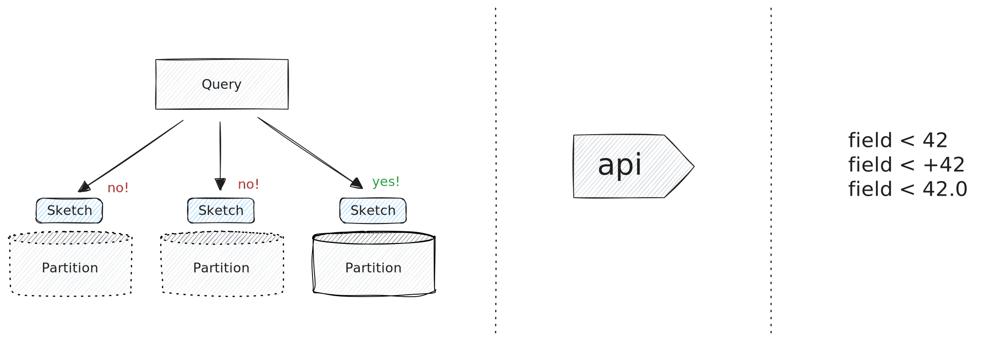

Here comes [Tenzir v4.5](https://github.com/tenzir/tenzir/releases/tag/v4.5.0)!
This release ships a potpourri of smaller improvements that result in faster
historical query execution and better deployability.



<!-- truncate -->

## More Robust Numeric Query Expressions

Ever scratched your head what numeric literal to use in a query so that you hit
the right fields in events? No more! You can now write `x < 42`, `x < +42`, or
`x < 42.0` in an expression to filter events where the field `x` is less than
42, regardless of whether `x` is of type `uint64`, `int64`, or `double`.
Previously, you had to know the exact number type for the expression to bind
properly to the event schema.

This incremental improvement is part of a larger thrust to improve the language.
We have plans to convert additional literals during expression bindings to
provide deeper reach into the data, without users really having to deal with
schemas.

## Sparse Indexes for Number Types

Tenzir's storage engine builds sparse indexes per partition. These sketch
data structures, like Bloom filters and min-max synopses, accelerate historical
queries by ensuring that only relevant partitions get loaded into memory.

We've now added additional sketches for types `bool`, `time`, `duration`,
`int64`, `uint64`, and `double` to accelerate a broader range of queries. For
eaxmple, this query now runs faster:

```
export
| where :timestamp > 1 hour ago && dest_port == 80
```

## The API as Operator

We exposed the API as a new operator called
[`api`](/next/operators/sources/api). The benefit primarily materializes for
developers who can now rapidly prototype integrations by using the app or
`tenzir` command line tool, without having to do spin up the integrated web
server and do gymnastics with `curl` and `jq`.

TODO: provide an example

## Fine-Grained Operator Block Lists

We made it easier to disallow potentially unsafe operators. The new
`tenzir.disable-plugins` option is a list of names of plugins to explicitly
forbid from being used. For example, adding `export` will prohibit use of the
`export` operator builtin, thereby disabling the ability to run historical
queries. This method allows for a more fine-grained control than the coarse
`tenzir.allow-unsafe-pipelines` option.

Why does it matter? Well, when running pipelines in a node, some operators allow
you to fully interact with the system through a pipeline. The
[`shell`](/operators/transformations/shell) operator is the best example, which
allows for arbitrary command execution. This can be both a huge relief and serve
as escape hatch to integrate third-party tools, but it is equally a security
risk.

## This & That

- When you deploy a demo node at [app.tenzir.com](https://app.tenzir.com), it
  now starts up faster, the pre-loaded pipelines come with labels, and have been
  ported to use the native connector API instead of relying on cURL.

- It is now possible to reference nested records in many operators that wrangle
  data, such as `select`, `extend`, `put`, and `replace`.

- The `summarize` operator now behaves more like other data frame processing
  engine and TODO.

- The `import` operator now flushes events to disk automatically before
  returning, ensuring that they are available immediately for subsequent uses of
  the `export` operator.

We provide a full list of changes [in our changelog](/changelog#v450).

Head over to [app.tenzir.com](https://app.tenzir.com) to check out what's new.
Got questions? Swing by our friendly [our Discord server](/discord) and let us
know.
