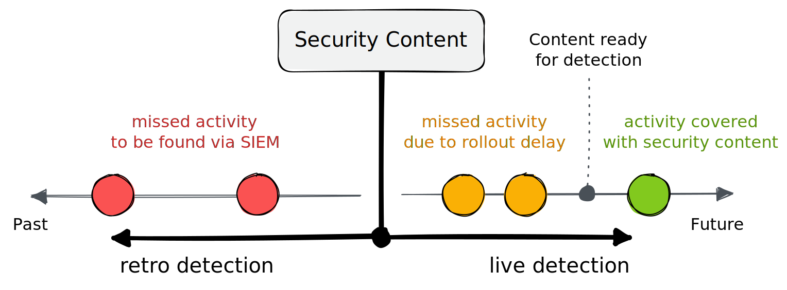
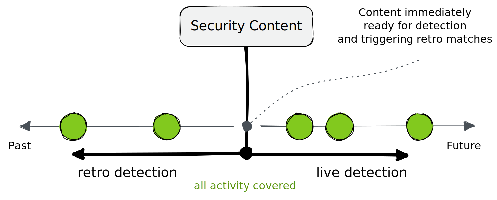

# Unified Detection

The traditional way of operationalizing security content is *forward-looking*,
by disseminating the content to the detection edge where they can act, e.g.,
network sensors or endpoint agents. If the roll-out relies on periodic pulling,
then there's an inherent minimum delay from the time a detection was available
to the time when it can act. In addition, if there is no historical telemetry at
the edge, the detection must also be applied to the SIEM out-of-band. The
diagram below illustrates this:

What we really want is a *unified* approach for operationalizing security
content: automated push-based dissemination with a negligible propagation delay
and installation at the detection edge, so the that future telemetry streams
through the engine. When keeping telemetry at the edge, the new detection should
also immediately trigger a retro scan:

This architecture decouples the arrival of new security content from the
execution of the detection. Tenzir runs in production with this use case for
detections in the form of tactical indicators. We are in the process of
extending this mechanism to more advanced stateful detections, e.g., Sigma
correlations or machine-learning models.

:::note Suricon 2021
Check out [our talk][suricon21-slides] with [DCSO](https://dcso.de) at [Suricon
2021](https://suricon.net/suricon-2021-boston/) on how Tenzir supports this
architecture with Suricata telemetry and security content in the form of STIX
indicators.
:::

[suricon21-slides]: https://github.com/tenzir/events/releases/download/suricon21/slides.pdf
