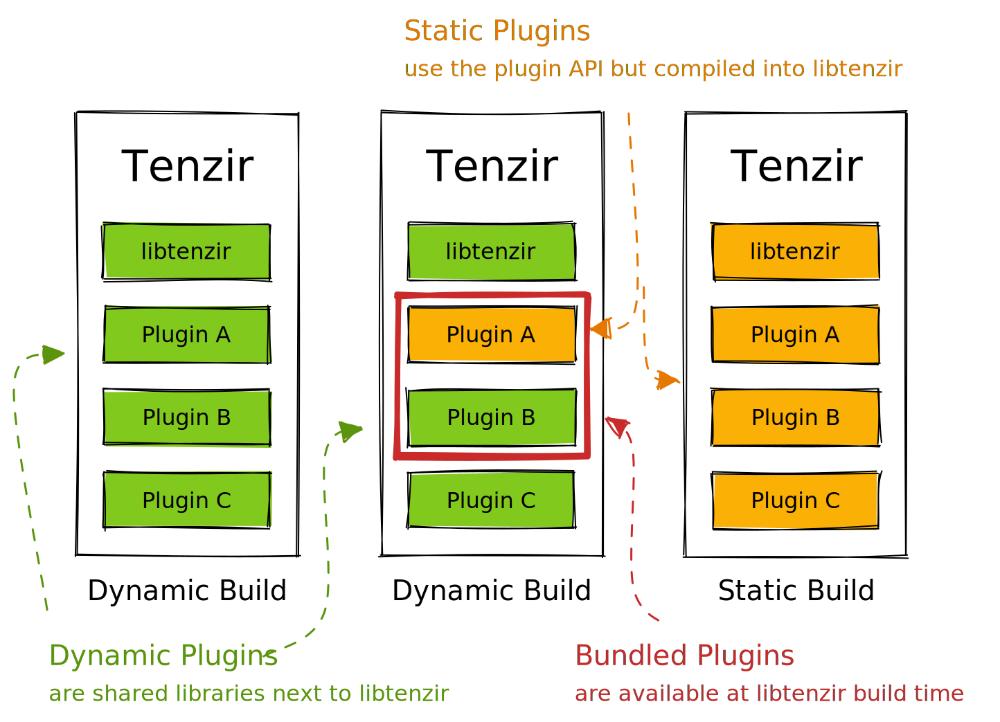

# Plugins

Tenzir has a plugin system that makes it easy to hook into various places of
the data processing pipeline and add custom functionality in a safe and
sustainable way. A set of customization points allow anyone to add new
functionality that adds CLI commands, receives a copy of the input stream,
spawns queries, or implements integrations with third-party libraries.

There exist **dynamic plugins** that come in the form shared libraries, and
**static plugins** that are compiled into libtenzir or Tenzir itself:

Plugins do not only exist for extensions by third parties, but Tenzir also
implements core functionality through the plugin API. Such plugins compile as
static plugins. Because they are always built, we call them *builtins*.

Tenzir offers several customization points to exchange or enhance functionality
selectively. Here is a list of available plugin categories and plugin types.

## Pipeline

The following plugin types allow for adding
[pipeline](../../understand/pipelines.md) logic.

### Operator

The pipeline plugin adds a new [pipeline
operator](../../understand/operators/README.md) that users can reference in a
[pipeline definition](../../understand/pipelines.md).

### Aggregation Function

The aggregation function plugin adds a new [aggregation
function](../../understand/operators/transformations/summarize.md#aggregate-functions)
for the `summarize` pipeline operator that performs an incremental aggregation
over a set of grouped input values of a single type.

## Connector

The following plugin types allow for adding
[connectors](../../understand/connectors/).

### Loader

The loader plugin defines the input side of a connector for use in the `from
CONNECTOR read FORMAT` and `load CONNECTOR` operators.

### Saver

The saver plugin defines the output side of a connector for use in the `write
FORMAT to CONNECTOR` and `save CONNECTOR` operators.

## Format

The following plugin types allow for adding
[formats](../../understand/formats/).

### Parser

The parser plugin defines the input side of a format for use in the `from
CONNECTOR read FORMAT` and `parse FORMAT` operators.

### Printer

The parser plugin defines the output side of a
[format](../../understand/formats/) for use in the `write FORMAT to CONNECTOR`
and `print FORMAT` operators.

## System

The following plugin types allow for adding system-wide functionality.

### Command

The command plugin adds a new command to the `tenzir-ctl` executable, at a
configurable location in the command hierarchy. New commands can have
sub-commands as well and allow for flexible structuring of the provided
functionality.

### Store

Inside a partition, the store plugin implements the conversion from in-memory
Arrow record batches to the persistent format, and vice versa.

:::tip Store = Format
Every store plugin is also a [format](#format) and acts as both
[parser](#parser) and [printer](#printer).
:::

### Component

The component plugin spawns a component inside a node. A component is an
[actor](actor-model) and runs in parallel with all other components.

This plugin is the most generic mechanism to introduce new functionality.
