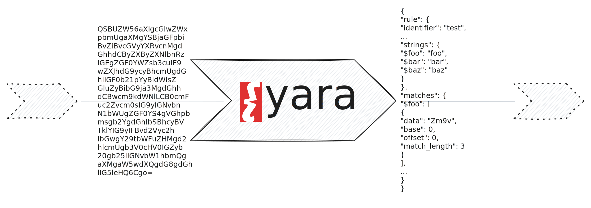

# yara

Executes YARA rules on byte streams.

## Synopsis

```
yara [-B|--blockwise] [-C|--compiled-rules] [-f|--fast-scan] <rule> [<rule>..]
```

## Description

The `yara` operator applies [YARA](https://virustotal.github.io/yara/) rules to
an input of bytes, emitting rule context upon a match.



We modeled the operator after the official [`yara` command-line
utility](https://yara.readthedocs.io/en/stable/commandline.html) to enable a
familiar experience for the command users. Similar to the official `yara`
command, the operator compiles the rules by default, unless you provide the
option `-C,--compiled-rules`. To quote from the above link:

> This is a security measure to prevent users from inadvertently using compiled
> rules coming from a third-party. Using compiled rules from untrusted sources
> can lead to the execution of malicious code in your computer.

The operator uses a YARA *scanner* under the hood that buffers blocks of bytes
incrementally. Even though the input arrives in non-contiguous blocks of
memories, the YARA scanner engine support matching across block boundaries. For
continuously running pipelines, use the `--blockwise` option that considers each
block as a separate unit. Otherwise the scanner engine would simply accumulate
blocks but never trigger a scan.

### `-B|--blockwise`

Match on every byte chunk instead of triggering a scan when the input exhausted.

This option makes sense for never-ending dataflows where each chunk of bytes
constitutes a self-contained unit, such as a single file.

### `-C|--compiled-rules`

Interpret the rules as compiled.

When providing this flag, you must exactly provide one rule path as positional
argument.

### `-f|--fast-scan`

Enable fast matching mode.

### `<rule>`

The path to the YARA rule(s).

If the path is a directory, the operator attempts to recursively add all
contained files as YARA rules.

## Examples

The examples below show how you can scan a single file and how you can create a
simple rule scanning service.

### Perform one-shot scanning of files

Scan a file with a set of YARA rules:

```
load file --mmap evil.exe | yara rule.yara
```

:::info Memory Mapping Optimization
The `--mmap` flag is merely an optimization that constructs a single chunk of
bytes instead of a contiguous stream. Without `--mmap`, the
[`file`](../../connectors/file.md) loader generates a stream of byte chunks and
feeds them incrementally to the `yara` operator. This also works, but
performance is better due to memory locality when using `--mmap`.
:::

Let's unpack a concrete example:

```yara
rule test {
  meta:
    string = "string meta data"
    integer = 42
    boolean = true

  strings:
    $foo = "foo"
    $bar = "bar"
    $baz = "baz"

  condition:
    ($foo and $bar) or $baz
}
```

You can produce test matches by feeding bytes into the `yara` operator:

```bash
echo 'foo bar' | tenzir 'load stdin | yara /tmp/test.yara'
```

You will get one `yara.match` per matching rule:

```json
{
  "rule": {
    "identifier": "test",
    "namespace": "default",
    "tags": [],
    "meta": {
      "string": "string meta data",
      "integer": 42,
      "boolean": true
    },
    "strings": {
      "$foo": "foo",
      "$bar": "bar",
      "$baz": "baz"
    }
  },
  "matches": {
    "$foo": [
      {
        "data": "Zm9v",
        "base": 0,
        "offset": 0,
        "match_length": 3
      }
    ],
    "$bar": [
      {
        "data": "YmFy",
        "base": 0,
        "offset": 4,
        "match_length": 3
      }
    ]
  }
}
```

Each match has a `rule` field describing the rule and a `matches` record
indexed by string identifier to report a list of matches per rule string.

### Build a YARA scanning service

Let's say you want to build a service that scans malware sample that you receive
over a Kafka topic `malware`.

Launch the processing pipeline as follows:

```
load kafka --topic malware | yara --blockwise /path/to/rules
```

If you run this pipeline on the command line via `tenzir <pipeline>`, you see
the matches arriving as JSON. You could also send the matches via the
[`fluent-bit`](../sinks/fluent-bit.md) sink to Slack, Splunk, or any other
Fluent Bit output. For example, via Slack:

```
load kafka --topic malware
| yara --blockwise /path/to/rules
| fluent-bit slack webhook=<url>
```

This pipeline requires that every Kafka message is a self-contained malware
sample. Because the pipeline runs continuously, we supply the `--blockwise`
option so that the `yara` triggers a scan for every Kafka message, as opposed to
accumulating all messages indefinitely and only initiating a scan when the input
exhausts.

You can now submit a malware sample by sending it to the `malware` Kafka topic:

```
load file --mmap evil.exe | save kafka --topic malware
```

This pipeline loads the file `evil.exe` as single blob and sends it to Kafka, at
topic `malware`.
