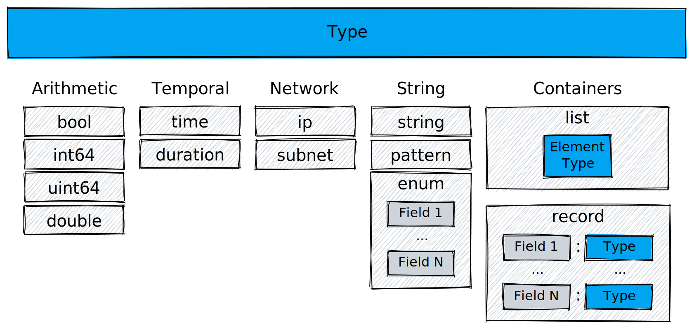
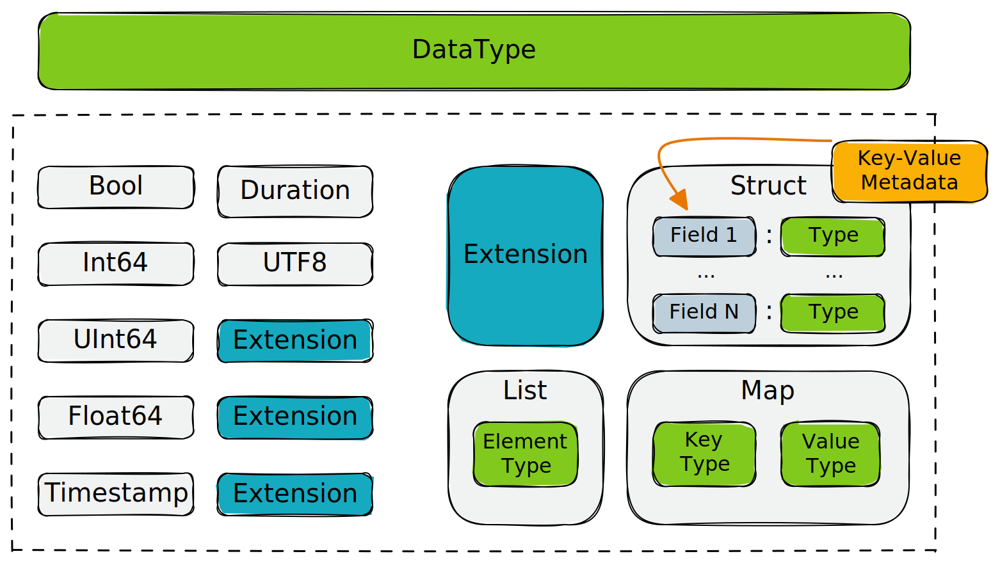

# Type System

One [design goal](/docs/understand/architecture/design-goals) of VAST is
being expressive enough to capture the semantics of the domain. This led us to
develop a rich type system for structured security data, inspired by the
[Zeek](https://zeek.org) network security monitor.

## Terminology

The diagram below illustrates the type system at a glance:



All type have an optional name. They coexist in a global namespace.

### Basic Types

Basic types are stateless types with a static structure. Their representation
is known a-priori.

The following tables summarizes the basic types.

| Type       | Description
| ---------- | --------------------------------------
| `none`     | Denotes an absent or invalid value
| `bool`     | A boolean value
| `int64`    | A 64-bit signed integer
| `uint64`   | A 64-bit unsigned integer
| `double`   | A 64-bit double (IEEE 754)
| `duration` | A time span (nanosecond granularity)
| `time`     | A time point (nanosecond granularity)
| `string`   | A sequence of characters
| `pattern`  | A regular expression
| `ip`       | An IPv4 or IPv6 address
| `subnet`   | An IPv4 or IPv6 subnet

### Complex Types

Complex types are stateful types that carry additional runtime information.

#### Enumeration

The `enum` type is a list of predefined string values. It comes in handy for
low-cardinality values from a fixed set of options.

VAST implements an `enum` as an Arrow Dictionary.

#### List

The `list` type is an ordered sequence of values with a fixed element type.

Lists have zero or more elements.

#### Record

The `record` type consists of an ordered sequence *fields*, each of which have a
name and type. Records must have at least one field.

The field name is an arbitrary UTF-8 string.

The field type is any VAST type.

Optionality of a field is reflected by its type.

### Optionality

All types are optional in that there exists an additional `null` data point in
every value domain. Consequently, VAST does not have a special type to indicate
optionality.

### Attributes

Every type has zero or more **attributes**, which are free-form key-value pairs
to enrich types with custom semantics.

### Aliases

An alias wraps an existing type under a new name. Aliases are first-class types,
meaning you can also attach separate attributes to them.

:::tip Alias = Specialization
An alias always *refines* the type it points to, i.e., it is more specific that
its parent. For example, let's assume a type `U` is an alias for an existing
type `T`. Then, the [type
extractor](/docs/understand/language/expressions#type-extractor) `:U` only
resolves for types of instance `U`. However, `:T` comprises both instances of
types `U` and `T`.
:::

## Type Construction

VAST comes with a lean type definition language. Think [JSON
schema](https://json-schema.org/) fused with [Kaitai](https://kaitai.io/), with
the goal that humans can jot it down quickly. We use YAML as vehicle to express
the structure because that's already VAST's language for configuration.

How do you refer to a type? The basic scaffold looks like this:

```yaml
type: T
attributes:
  - key: value
  - value # values are optional
```

This assumes that the type `T` exists already. This begs a recursive question:
what are valid values for `T`? These are either basic types, such as `bool`,
`string`, `ip`, or types defined according the rules described below.

### Alias Type

Use a dictionary to give an existing type a new name:

```yaml
url: string
```

This introduces a type with the name `url`.

Instead of referencing an existing type, you can also provide an inline
definition of a type:

```yaml
url:
  type: string
  attributes:
    - unescaped
```

### Enumeration Type

Use an `enum` dictionary with a list of allowed values to define it:

```yaml
enum:
  - on
  - off
```

### List Type

Use the `list` key to define list with a corresponding element type on the
right-hand side:

```yaml
list: url
```

Lists nest naturally:

```yaml
list:
  list:
    enum:
      - on
      - off
```

### Record Type

Use the `record` key to define a list of fields:

```yaml
record:
  - src_ip: ip
  - dst_ip: ip
  - src_port: port # existing alias
  - dst_port: port # existing alias
  - proto: string
```

Records nest naturally:

```yaml
record:
  - src:
      record:
        - ip: ip
        - port: uint64
  - dst:
      record:
        - ip: ip
        - port: uint64
  - proto: string
```

We can also factor nested records into dedicated types:

```yaml
endpoint:
  record:
    - ip: ip
    - port: uint64
```

Thereafter we can reference the `endpoint` type by its name:

```yaml
record:
  - src: endpoint
  - dst: endpoint
```

Records of lists:

```yaml
record:
  - values:
      list: string
```

Lists of records:

```yaml
list:
  record:
    - question: string
    - correct: bool
```

#### Record Algebra

In addition to nesting records, a frequent use case is embedding fields of
one record into another. This occurs often with families of event types that
share a large portion of fields. Algebraically, we want to "add" the two records
together to combine their field.

For example, consider this `common` record with a single field `shared`:

```yaml
# The base record.
common:
  record:
    - shared:
        type: bool
```

To embed `common` in another record, reference it using the `base` key. This
requires moving the fields one layer down under the `fields` key:

```yaml
record:
  base:
    - common
  fields:
    - unique: string
```

The effect is the same specifying a single record with two fields:

```yaml
record:
  - shared: bool
  - unique: string
```

There are three special keys under the `record` key that control what to do when
field name clashes occur between the two records:

1. `base`: raise an error
2. `implant`: prefer the base record
3. `extend`: prefer the current record

## Comparison to Arrow

There exists a one-to-one mapping of VAST's type system to Arrow's type system
to ensure that transferred data is self-describing:



Note that VAST attaches attributes to a top-level type instance, where Arrow
only allows type meta data for record fields. VAST converts enum, IP, and
subnet types to [extension-types][extension-types].

[extension-types]: https://arrow.apache.org/docs/format/Columnar.html#extension-types

:::tip More on Arrow & VAST
If you want to learn more about why VAST uses Apache Arrow, please read our
[two](/blog/apache-arrow-as-platform-for-security-data-engineering) [blog
posts](/blog/parquet-and-feather-enabling-open-investigations) that explain why
we build on top of Arrow.
:::
